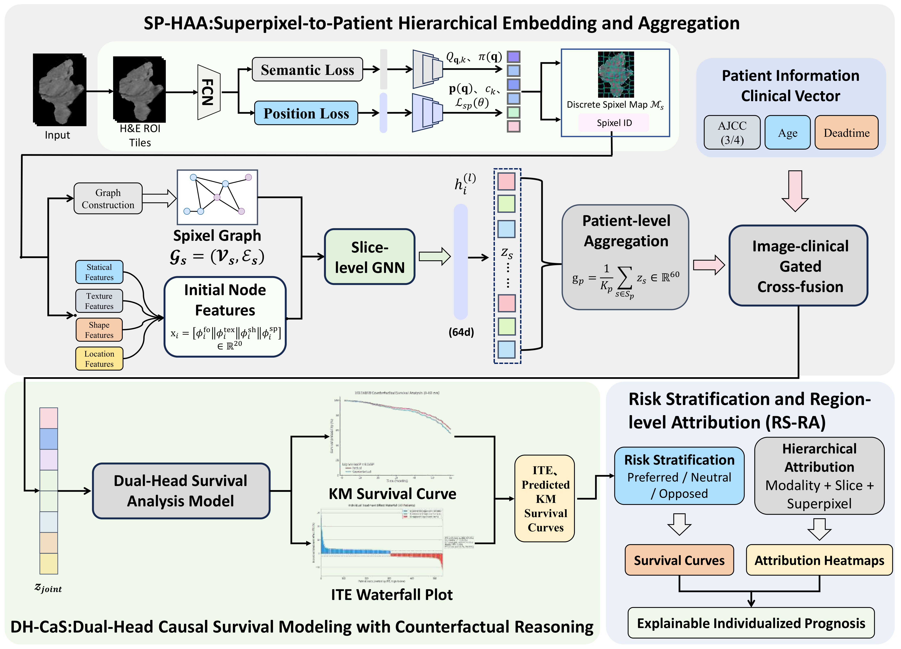
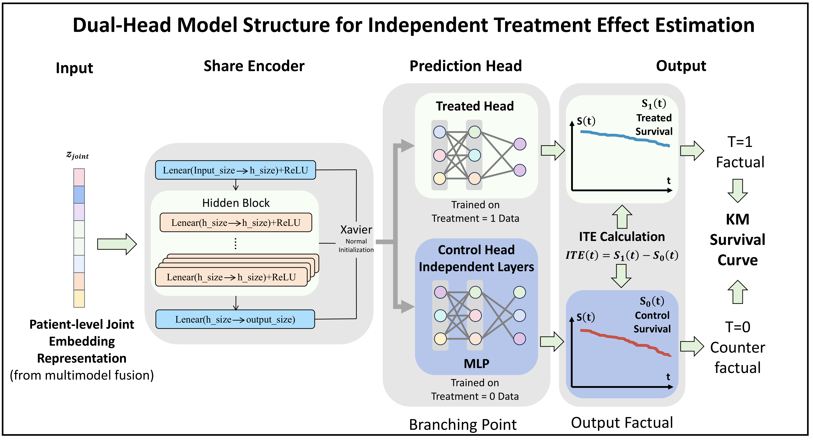

# SG-PPL:Superpixel-Graph Prognostic Phenotype Learning for Explainable Individualized Survival Prediction in Nasopharyngeal Carcinoma

**Superpixel-Graph Prognostic Phenotype Learning**

SG-PPL is a fully automated framework for explainable, individualized survival prediction in nasopharyngeal carcinoma (NPC). From pretreatment MRI of the nasopharynx and neck plus a short clinical record, it learns which spatial patterns carry prognostic meaning, emits **factual and counterfactual survival curves** for each patient, and traces the prediction back to **anatomical regions**—without a radiologist-drawn tumor contour.

> 面向鼻咽癌治疗前 MRI 的可解释个体化预后：队列共享的可学习超像素 → 组学图与 GNN → 无治疗泄漏的门控多模态融合 → 双头 Cox 事实/反事实生存曲线与 RMST-ITE → 模态–切片–超像素归因。无需人工勾画。

---

## What this project does

Patients who share the same stage and protocol still follow different courses. Conventional pipelines either need a manual GTV before radiomics, or treat an MRI slice as a pixel grid that cannot be inspected as anatomy. They typically stop at a **scalar risk**, with no per-patient Kaplan–Meier-style curve and no region a clinician can locate on the examination.

SG-PPL recasts the problem as **prognostic phenotype learning**: not “predict survival from a given feature list”, but **learn from the MRI what should be used to predict survival**, and expose that information in units a clinician already reasons about. Three stages close that chain.

<p align="center">
  
</p>
<p align="center"><sub><b>Figure 1.</b> Framework overview. <i>SP-HAA</i> builds a treatment-free image–clinical embedding from superpixel graphs; <i>DH-CaS</i> reads factual / counterfactual survival curves and an RMST-based ITE; <i>RS-RA</i> stratifies patients and attributes the prediction to modalities, slices, and superpixels. <a href="overview.pdf">PDF</a></sub></p>

| Stage | Role |
| --- | --- |
| **SP-HAA** | Superpixel-to-patient hierarchy: learnable regions → radiomic graph → GNN → patient image vector → gated fusion with AJCC and age (treatment held out) → \(\mathbf{z}_{\text{joint}}\) |
| **DH-CaS** | Dual treatment-conditional Cox heads on a shared encoder: factual vs. counterfactual \(S(t)\), RMST-ITE, bootstrap uncertainty |
| **RS-RA** | ITE-preferred / opposed / neutral strata; Integrated Gradients folded back to modality, slice, and superpixel heatmaps |

The stages are not interchangeable add-ons. SP-HAA is the only substrate from which DH-CaS can query both arms without leaking the administered treatment into the covariates, and the only substrate on which RS-RA can land an explanation on genuine region boundaries rather than unnamed pixels.

---

### SP-HAA — from slices to a treatment-free embedding

A whole examination is an unordered, variable-sized set of slices. Full-resolution grids are redundant and easy to overfit on small survival cohorts. SP-HAA abstracts evidence **bottom-up**.

1. **Learnable superpixels.** An FCN with **parameters shared across the cohort** predicts a soft 9-neighborhood assignment on a lattice (stride 16). Unlike SLIC, which re-solves Lloyd clustering independently on every scan under a handcrafted appearance criterion, the partition rule is amortized over the population so recurrent anatomy can inform every patient. Inference takes a hard label map \(\pi(\mathbf{q})=\arg\max_k Q_{\mathbf{q},k}\).
2. **Radiomic graph.** Each superpixel is a node; edges follow 4-connected label adjacency. Nodes carry a 20-D phenotype: first-order moments (9), GLCM texture (4), shape (5), normalized centroid (2).
3. **Slice GNN.** Three mean-aggregation layers (hidden 64) plus global mean pool → 64-D slice embedding \(\mathbf{z}_s\).
4. **Patient pool.** Mean over slices, \(\mathbf{g}_p\in\mathbb{R}^{64}\), invariant to how many slices are present.
5. **Cross-gated fusion.** Clinical covariates are **treatment-free**: AJCC embedding (4-D) and age. Imaging and clinical streams are projected to 128-D; a clinical gate modulates the image stream; a Hadamard cross term encodes interaction; LayerNorm yields \(\mathbf{z}_{\text{joint}}\in\mathbb{R}^{128}\). Induction chemotherapy (`youdao`) is **not** admitted here, so the embedding remains a valid pre-treatment adjustment set for the causal head.

<p align="center">
  
</p>
<p align="center"><sub><b>Figure 2.</b> Image–clinical cross-gated fusion. Projected streams \(\mathbf{u}_p\) and \(\mathbf{v}_p\) are combined as a clinically gated image term, a clinical term, and a Hadamard cross term, then layer-normalized into \(\mathbf{z}_{\text{joint}}\). <a href="cross%20gated%20fusion.pdf">PDF</a></sub></p>

---

### DH-CaS — individualized curves and treatment contrast

Each patient has potential outcomes under both treatment arms; only the administered arm is observed. DH-CaS trains on factual Cox partial likelihood and **queries the opposite head** at inference.

<p align="center">
  
</p>
<p align="center"><sub><b>Figure 3.</b> Dual-head causal survival network. A shared encoder maps \(\mathbf{z}_{\text{joint}}\) to a latent risk representation; two treatment-conditioned heads emit Cox log-risks. The matching head is factual (supervised); the opposite head is counterfactual. A shared Breslow baseline turns both scores into survival curves used for the ITE. <a href="DH-CaS.pdf">PDF</a></sub></p>

- Shared MLP encoder \(\mathbf{h}_p=\mathrm{Enc}(\mathbf{z}_{\text{joint}})\), then heads \(r^{(0)}\) and \(r^{(1)}\).
- Shared Breslow baseline \(\widehat{H}_0(t)\) → \(S_p^{\mathrm{F}}(t)\) and \(S_p^{\mathrm{CF}}(t)\).
- ITE is the **relative change in restricted mean survival time** at \(\tau=60\) months (5 years):
  \[
  \mathrm{ITE}_p=\frac{\mathrm{RMST}(S_p^{\mathrm{CF}};\tau)-\mathrm{RMST}(S_p^{\mathrm{F}};\tau)}{\max\bigl(\lvert\mathrm{RMST}(S_p^{\mathrm{F}};\tau)\rvert,\varepsilon\bigr)}.
  \]
  Positive ITE: the alternative allocation is predicted to prolong restricted survival. Bootstrap supplies a 95% CI and a two-sided \(p\)-value.

The cohorts this design targets are observational. Ignorability cannot be fully guaranteed. **ITE is a predictive association for decision support, not a strict causal scientific conclusion.**

---

### RS-RA — strata you can act on, regions you can inspect

Patients are grouped by the sign of \(\mathrm{ITE}_p\) and bootstrap significance (\(\alpha=0.05\)), with a minimum-magnitude filter so tiny effects are not treated as actionable:

- **ITE-preferred** — switching is predicted to help;
- **ITE-opposed** — switching is predicted to harm;
- **ITE-neutral** — otherwise.

Integrated Gradients (zero baseline) attributes the treatment-arm risk back along the SP-HAA hierarchy: **modality shares** (image vs. clinical), **slice profile**, and **per-superpixel JET heatmaps** aligned with the learned boundaries.

---

## Repository

```
SG-PPL/
├── README.md
├── requirements.txt
├── overview.pdf / overview.png
├── DH-CaS.pdf / DH-CaS.png
├── cross gated fusion.pdf / .png
├── Main/                          # default pipeline (run from this directory)
│   ├── fcn_superpixel/            # learnable superpixel FCN
│   ├── pipeline/                  # Steps 1–7
│   ├── CXGNN/                     # shared MLP encoder (Step 6)
│   ├── causalreasoning/           # RS-RA attribution
│   └── run_step{1–7}.py
└── Experience/                    # optional variants
    ├── ablation/SLIC_function/    # SLIC instead of FCN superpixels
    ├── ablation/concat/           # concat fusion instead of gated fusion
    ├── ablation/Single_head/      # single Cox head, treatment as an input
    └── comparative/               # Cox / DeepSurv / T-learner on Step-4 features
```

| Code | Paper module |
| --- | --- |
| `Main/fcn_superpixel` + Steps 1–5 | SP-HAA |
| Step 6 | DH-CaS |
| Step 7 + `Main/causalreasoning` | RS-RA |

---

## Installation

Python 3.8+. A CUDA GPU is recommended. All Python packages are in [`requirements.txt`](requirements.txt) (`torch`, `torchvision`, `numpy`, `scipy`, `opencv-python`, `scikit-image`, `Pillow`, `matplotlib`, `captum`). That file covers the main pipeline, FCN superpixels, the SLIC variant, Step-7 plots, and attribution.

Install a CUDA build of PyTorch first, then the rest:

```bash
git clone https://github.com/<org>/SG-PPL.git
cd SG-PPL

python -m venv .venv
# Windows: .venv\Scripts\activate
source .venv/bin/activate

pip install torch torchvision --index-url https://download.pytorch.org/whl/cu121
pip install -r requirements.txt
```

CPU-only: skip the CUDA index URL and let `requirements.txt` pull `torch`. FCN `--enforce_connect` needs the SuperpixelFCN Cython extension; inference works without it.

---

## Data layout

**`clinical.csv`**

| Column | Role |
| --- | --- |
| `patient_id` | Matches the image folder name |
| `deadtime` | Follow-up time (months) |
| `event` | 1 = event; if the column is missing, the loader uses 1 |
| `youdao` | Binary treatment (induction chemotherapy), \(\{0,1\}\) |
| `ajcc` | Stage code (integer) |
| `age` | Age (years) |

**Raw slices** (FCN train / infer):

```
img/{patient_id}/{patient_id}_t1c_image_z_0020.png
```

**After superpixel infer** (Step 1 input):

```
dataset/{patient_id}/map_csv/      # H×W CSV, 1-based superpixel IDs
dataset/{patient_id}/spixel_viz/   # overlays for attribution
```

Filenames should include `z_` or `slice_{id}` so maps line up with the original slices. Imaging and tables are not bundled; point the CLI at your own paths.

---

## Usage

Run Steps 1–7 from `Main/`.

**Superpixels**

```bash
cd Main/fcn_superpixel

python train.py --image_dir /path/to/img --save_dir ./ckpt --recursive --use_slic

python infer.py \
  --image_dir /path/to/img \
  --output /path/to/dataset \
  --pretrained ./ckpt/checkpoint_epoch100.pth \
  --recursive --preserve_structure --suffix png
```

`img_size` must be a multiple of 16 (default `208×208`). `--downsize` is the lattice stride (default 16).

**Main pipeline**

```bash
cd Main

python run_step1.py --dataset ./dataset --output ./output/step1 --image_dir /path/to/img
python run_step2.py --step1_output ./output/step1 --output ./output/step2 --image_dir /path/to/img
python run_step3.py --step2_output ./output/step2 --output ./output/step3
python run_step4.py --step3_output ./output/step3 --output ./output/step4
python run_step5.py --clinical ./clinical.csv --step4_output ./output/step4 --output ./output/step5
python run_step6.py --step5_output ./output/step5 --output ./output/step6 --inference_all
python run_step7.py --step6_output ./output/step6 --output ./output/step7 --patients 10071200
```

Step 6 defaults: 600 epochs, AdamW `lr=1e-3`, `--head_hidden 32`, 200 bootstraps, `seed=42`. `--inference_all` scores every patient; omit it to score only val/test.

**Attribution**

```bash
python -m causalreasoning.run_attribution --patient 10071200 --dataset_root ./dataset
```

Writes `output/causalreasoning_output/{patient_id}/` (JSON + heatmaps). Use `--no_visualize` for JSON only.

---

## Variants (`Experience/`)

Same split and training protocol; swap one piece.

| Folder | Swap |
| --- | --- |
| `ablation/SLIC_function` | Classical SLIC maps instead of FCN |
| `ablation/concat` | Concat + linear projection instead of gated fusion |
| `ablation/Single_head` | One head \(f(x,t)\) instead of two treatment heads |
| `comparative` | Cox, DeepSurv, or T-learner on Step-4 features |

```bash
cd Experience/ablation/SLIC_function
python run_slic_pipeline.py -i /path/to/img -d ./dataset --run-output ./output -c /path/to/clinical.csv

cd Experience/comparative
python -m comparative.run_cox --step4_output ../ablation/SLIC_function/output/step4 \
  --step5_output /path/to/Main/output/step5 --tag slic_cox
python -m comparative.run_deepsurv --step4_output ../ablation/SLIC_function/output/step4 \
  --step5_output /path/to/Main/output/step5 --tag slic_deepsurv
python -m comparative.run_tlearner --step4_output ../ablation/SLIC_function/output/step4 \
  --step5_output /path/to/Main/output/step5 --tag slic_tlearner
```

Comparative models use treatment-free inputs `[image, ajcc, age]`. Cox uses L-BFGS + a ridge grid. See [`Experience/ablation/SLIC_function/README.md`](Experience/ablation/SLIC_function/README.md) and [`Experience/comparative/README.md`](Experience/comparative/README.md).

---

## Outputs

| Path | Content |
| --- | --- |
| `output/step1/step1_slice_graphs.pkl` | Slice graphs, coordinates |
| `output/step2/step2_slice_graphs.pkl` | Graphs + 20-D node features |
| `output/step3/` | Slice embeddings |
| `output/step4/` | Patient imaging vectors |
| `output/step5/step5_aligned_data.pkl` | Fused features and train/val/test split |
| `output/step6/step6_model.pt` | Dual-head weights (best validation C-index) |
| `output/step6/step6_counterfactual_results.pkl` | Curves, RMST, ITE (legacy field `IC` = ITE) |
| `output/step7/` | Survival / waterfall figures |
| `output/causalreasoning_output/` | IG JSON and superpixel heatmaps |

Step 6 also reports **C-index** and **IBS**. ITE is a decimal (×100 → percent).

---

## Disclaimer

Research code only — not a medical device and not clinical advice. Do not use it as the sole basis for treatment decisions.

---

## Acknowledgements

Superpixel FCN follows SuperpixelFCN / Superpixel Sampling Networks. The Step-6 encoder reuses the CXGNN MLP. Attribution uses [Captum](https://captum.ai/).
